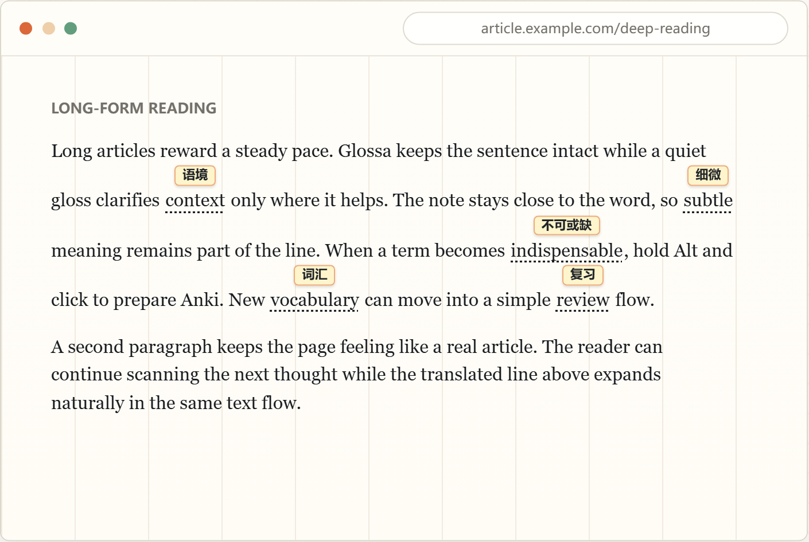

<div align="center">
  <h1>Glossa</h1>

  
</div>

Glossa 是一个 Chrome 扩展，用来在网页中给陌生英文单词显示中文释义，并把需要学习的单词加入 Anki。

## 安装

1. 打开 [Glossa 最新 Release](https://github.com/JiaJunDeng5930/glossa/releases/latest)
2. 下载发布页里的扩展安装包
3. 解压安装包到本地目录
4. 打开 Chrome 扩展管理页：`chrome://extensions/`
5. 打开右上角「开发者模式」
6. 点击「加载已解压的扩展程序」
7. 选择解压后的 Glossa 目录

## 功能

- 在网页正文中识别英文单词，并在单词上方显示中文释义
- 根据已知词表隐藏常见词，减少干扰
- 支持初中、高中、CET-4、CET-6、TOEFL、GRE、COCA 20000 等词表
- 支持点击单词创建 Anki 卡片
- 通过缓存减少重复 AI 请求
- 支持快捷键开启、关闭页面翻译
- 支持自定义释义样式、AI 设置、Anki 设置和提示词

## 使用方法

### 翻译当前网页

1. 点击 Chrome 工具栏里的 Glossa 图标
2. 点击「Translate」
3. Glossa 会扫描当前页面可见文本
4. 陌生词会显示中文释义标签

### 使用快捷键

在设置页配置翻译快捷键后，可以在网页中直接切换翻译状态。

### 添加单词到 Anki

1. 点击带有释义的英文单词
2. Glossa 会生成 Anki 卡片内容
3. 卡片写入你配置的 Anki deck
4. 遇到已添加过的单词时，页面右上角会出现确认提示

## 配置

### AI 设置

在设置页填写：

- Provider
- Endpoint
- API Key
- Reasoning effort
- Request timeout
- Gloss prompt
- Anki card prompt

支持的 Provider：

- OpenAI Responses API
- OpenAI Chat Completions API
- OpenAI Completions API
- Glossa Backend

### Anki 设置

在设置页填写：

- AnkiConnect endpoint
- Deck
- Model name
- Request timeout
- Duplicate card prompt duration

Anki model 需要包含 `Front` 和 `Back` 字段。

### 已知词过滤

选择适合自己的词表后，Glossa 会把这些单词视为已知词，页面中默认隐藏它们的释义。

可选词表：

- 初中
- 高中
- CET-4
- CET-6
- TOEFL
- GRE
- COCA 20000

### 外观设置

可以配置：

- 中文释义颜色
- 背景颜色
- 透明度
- 字体
- 字号

## 工作方式

Glossa 在当前页面扫描可见文本，把候选单词发送给后台服务。后台会先查询本地缓存和词汇状态，再按需调用 AI 获取释义。点击单词时，后台会生成 Anki 卡片并通过 AnkiConnect 写入 Anki。

## 常见问题

### 页面没有出现释义

确认当前页面翻译状态已开启，并检查已知词过滤设置。

### AI 请求失败

检查 Provider、Endpoint、API Key 和 Request timeout。

### Anki 创建失败

确认 Anki 已启动，AnkiConnect 已安装，并且 deck 与 model name 配置正确。

### 重复单词提示

这个提示表示该单词已经创建过卡片。确认后，Glossa 会继续创建一张新卡片。

## 开发

常用命令：

```bash
npm run typecheck
npm run test
npm run build
npm run verify
```

源码结构：

```text
src/content/      页面扫描、释义渲染、页面交互
src/background/   AI 请求、AnkiConnect、缓存、词汇状态
src/core/         词汇状态机、词形归一、缓存 key
src/storage/      设置和 IndexedDB 存储
src/options/      设置页
src/onboarding/   首次使用引导页
src/popup/        扩展弹窗
src/shared/       消息协议、快捷键、诊断工具
```

## License

待补充。
