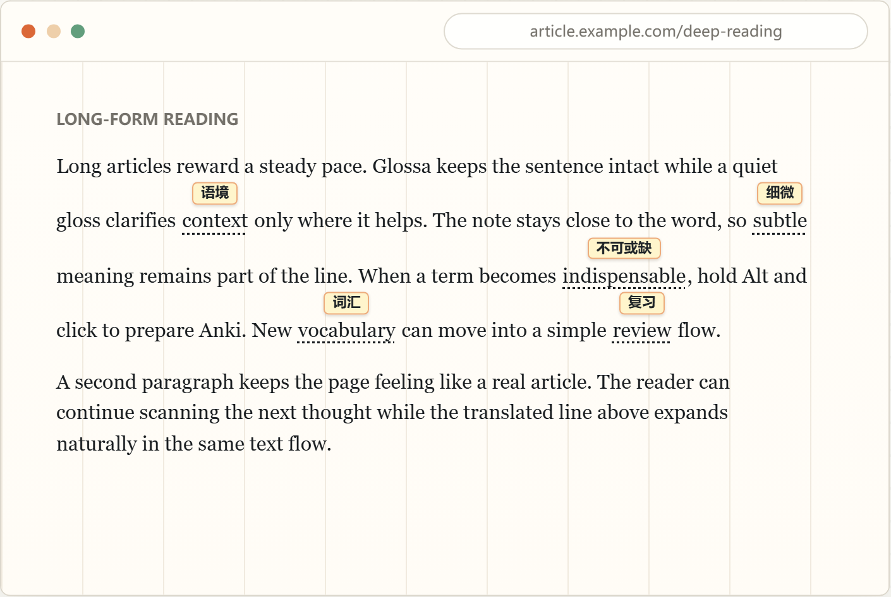

<div align="center">
  <h1>Glossa</h1>

  
</div>

Glossa 是一个 Chrome 扩展，用来在网页中给陌生英文单词显示中文释义，并把需要学习的单词加入 Anki。

## 安装

1. 打开 [Glossa 最新 Release](https://github.com/JiaJunDeng5930/glossa/releases/latest)
2. 下载发布页里的扩展安装包
3. 解压安装包到本地目录
4. 打开 Chrome 扩展管理页：`chrome://extensions/`
5. 打开右上角「开发者模式」
6. 点击「加载已解压的扩展程序」
7. 选择解压后的 Glossa 目录

## 功能

- 在网页正文中识别英文单词，并在单词上方显示中文释义
- 根据已知词表隐藏常见词，减少干扰
- 支持初中、高中、CET-4、CET-6、TOEFL、GRE、COCA 20000 等词表
- 支持为点击的单词创建 Anki 卡片
- 通过缓存减少重复 AI 请求
- 支持快捷键开启、关闭页面翻译
- 支持自定义释义样式、AI 设置、Anki 设置和提示词
- 支持本地词典查义，由 Jev 根据语境选择中文释义

## 使用方法

### 翻译当前网页

1. 点击 Chrome 工具栏里的 Glossa 图标
2. 点击「Translate」
3. Glossa 会扫描当前页面可见文本
4. 陌生词会显示中文释义标签

### 使用快捷键

在设置页配置翻译快捷键后，可以在网页中直接切换翻译状态。

### 添加单词到 Anki

1. 按住设置的制卡快捷键并点击单词
2. Glossa 会生成一张 Anki 卡片
3. 卡片写入你配置的 Anki deck
4. 遇到已经制过卡的单词时，页面右上角会出现确认提示

## 配置

### 翻译模式

设置页可选择普通模型翻译，或「词典 + Jev 释义选择」模式。后者从随扩展提供的 [ECDICT](https://github.com/skywind3000/ECDICT) 本地英汉词典读取单词及其词形对应的释义，将句子、目标单词和全部候选发送给 [Jev Choice](https://docs.typesafe.ai/primitives/choice)，显示它选中的词典释义。

Jev 有独立的 Endpoint、API Key、Model 和 Request timeout 设置。默认 Endpoint 为 `https://api.typesafe.ai/v1/systemone`，Model 为 `jev-latest`。选择此模式后可独立测试 Jev 连接，无须先接通普通模型。

未命中时回退到普通 AI 的选项默认关闭。开启后，仅词典中找不到的单词会交给普通模型；关闭时，未命中的单词显示红叉。普通模型未接通、Jev 请求失败或词典读取失败时，对应单词也只显示红叉，不弹出额外通知。Anki 制卡仍使用下方配置的普通模型。

### AI 设置

在设置页填写：

- Provider
- Endpoint
- API Key
- Reasoning effort
- Request timeout
- Gloss prompt
- Anki card prompt

支持的 Provider：

- OpenAI Responses API
- OpenAI Chat Completions API
- OpenAI Completions API
- Glossa Backend

### Anki 设置

在设置页填写：

- AnkiConnect endpoint
- Deck
- Model name
- Request timeout
- Duplicate card prompt duration

Anki model 需要包含 `Front` 和 `Back` 字段。

### 已知词过滤

选择适合自己的词表后，Glossa 会把这些单词视为已知词，页面中默认隐藏它们的释义。

可选词表：

- 初中
- 高中
- CET-4
- CET-6
- TOEFL
- GRE
- COCA 20000

### 外观设置

可以配置：

- 中文释义颜色
- 背景颜色
- 透明度
- 字体
- 字号

## 工作方式

Glossa 在当前页面扫描可见文本，把候选单词交给后台服务。后台先查询缓存和词汇状态，再按需调用 AI；制卡请求通过 AnkiConnect 写入用户配置的 deck。

## 常见问题

### 页面没有出现释义

确认当前页面翻译状态已开启，并检查已知词过滤设置。

### AI 请求失败

检查 Provider、Endpoint、API Key 和 Request timeout。

### Anki 创建失败

确认 Anki 已启动，AnkiConnect 已安装，并且 deck 与 model name 配置正确。

### 重复单词提示

这个提示表示该单词已经创建过卡片。确认后，Glossa 会继续创建一张新卡片。

## 开发

常用命令：

```bash
npm run typecheck
npm run wordlists:check
npm run dictionary:check
npm run test
npm run build
npm run test:e2e
npm run preview:ui
npm run verify
```

后台、页面和引导的开发入口见各自的模块 README；跨模块的设计原因见 [ADR-0001](docs/adr/0001-async-ownership-and-contracts.md)。

## License

待补充。
