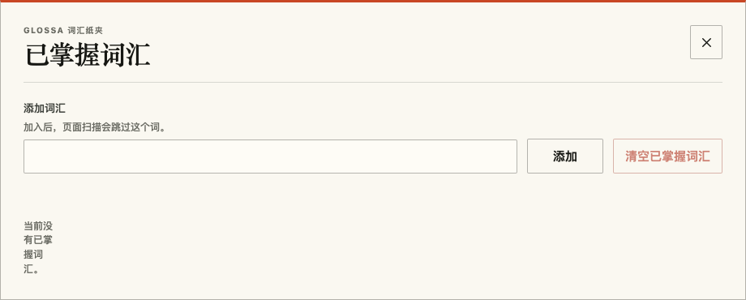
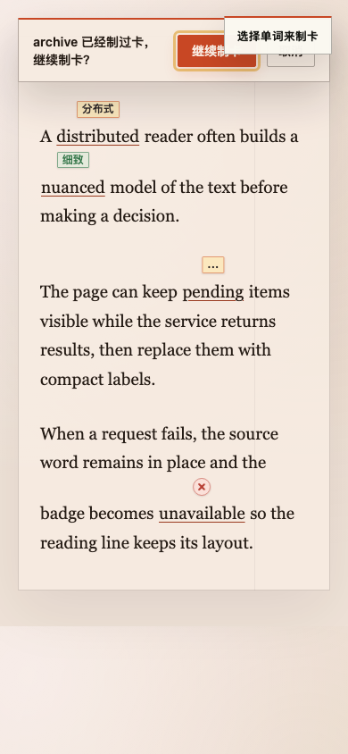

# Glossa 官网与扩展 UI/UX 审查

审查日期：2026-09-19 至 2026-09-20。源码基线：`888ece6`。本文是该版本的审查快照，不是产品行为契约。此次只新增审查文档和证据，没有修改产品代码。

## 结论与修正顺序

本次记录 **28 项问题与改进项**。最需要优先处理的是可见反馈与实际状态不一致、特殊状态下布局损坏，以及操作入口在长页面或浮层中难以找到。视觉方面最突兀的地方包括：空词汇提示逐字竖排、表单值和长提示词过粗、引导标题的默认蓝色焦点框、同一条链接中混用蓝色和朱红色下划线，以及官网断点附近被挤坏的章节标签。

建议按以下顺序处理：

1. **交互和状态反馈**：制卡浮层互相覆盖；制卡成功、失败与结果未知主要靠颜色区分；引导进度线固定在 1/8；翻页后的焦点丢失；加载时界面看似可操作却不响应。
2. **布局和可达性**：词汇空状态竖排；窄窗长设置页缺少就近保存入口；无字段定位的设置错误；最窄官网导航项被裁掉。
3. **视觉和文案细节**：控件字重、低对比度小字、默认蓝色样式、分栏留白失衡、过小的辅助按钮、缺字及用词不一致。

这些排序服务于实际使用。带有主观审美判断的项目会在详细报告中明确说明；暖纸色、大留白和衬线字体本身没有被当作缺陷。

## 范围与证据

| 界面 | 主要覆盖 | 详细报告 |
| --- | --- | --- |
| 官网 | 1440、1280、1081、1024、390、320px；各区段、滚动演示、导航、键盘、减少动态效果偏好 | [官网审查](2026-09-19-ui-ux/website.md) |
| 设置页 | 1440、390、320px；加载、保存、错误、空词汇与多词汇、AI/Jev/Anki、外观、快捷键、缓存 | [设置页审查](2026-09-19-ui-ux/options.md) |
| 首次使用引导 | 8 步、翻译方式分支、返回、跳过、加载状态；桌面、320px、小高度视口 | [入口审查](2026-09-19-ui-ux/entry.md) |
| 工具栏弹窗 | 正常、已开启、不可用、重试、超时、无效响应；约 360px mock 视口与真实扩展页面布局 | [弹窗覆盖说明](2026-09-19-ui-ux/entry.md#popup-覆盖结论) |
| 网页内 UI | 桌面、390、320px；密集标注、链接、深色宿主、选择、重复制卡、成功/失败/未知状态 | [阅读与制卡审查](2026-09-19-ui-ux/reading.md) |

已运行生产构建，使用生产渲染代码和隔离的浏览器页面/profile；模拟服务响应仅用于构造可重复的成功、失败和空数据状态，没有调用用户真实的 AI 或 Anki 服务。逐图检查并结合浏览器布局测量与源码定位。视觉参照为 [DESIGN.md](../../DESIGN.md)。

官网结论对应当前源码；线上部署版本没有确认。弹窗的真实扩展页面验证覆盖资源、尺寸与布局，可用/失败状态使用 transport mock；本次没有验证 Chrome 工具栏 action popup 的自动关闭行为。320/390px 表示窄视口检查，不表示已在移动版 Chrome 安装并运行扩展。

P2 表示明显影响理解、操作效率、阅读或显示质量；P3 表示局部视觉、文案及较低频的可用性改进。没有把纯粹“缺少某个新功能”直接当作当前缺陷。

验证结果：生产构建通过。3 个相关内容脚本浏览器测试中，制卡错误反馈和重复确认用例通过；布局用例在 `tests/e2e/content-overlay.spec.ts:1975` 未通过。对失败截图的核对表明，18px 差异来自普通词自然换行，而测试假定它与前一标注词同行，未观察到标签或原词重叠。因此记录这一测试限制，没有新增 UI 缺陷，也没有修改测试。详细证据见阅读报告的验证记录。

## 完整索引

### 官网（7 项）

| 编号 | 优先级 | 问题 |
| --- | --- | --- |
| [W01](2026-09-19-ui-ux/website.md#w01) | P2 | 320px 固定导航把 GitHub 链接裁掉，键盘焦点也落在可视区外 |
| [W02](2026-09-19-ui-ux/website.md#w02) | P2 | 多处小号元信息的文本对比度明显不足 |
| [W03](2026-09-19-ui-ux/website.md#w03) | P3 | 首屏中文文案出现“显示中文义”的缺词 |
| [W04](2026-09-19-ui-ux/website.md#w04) | P3 | 页脚 GitHub 链接的实际点击/触摸目标只有 55×13px |
| [W05](2026-09-19-ui-ux/website.md#w05) | P3 | reduced-motion 桌面模式把“连续演示”变成章节与制卡卡片同时出现的静态拼接 |
| [W06](2026-09-19-ui-ux/website.md#w06) | P3 | 1081px 交互演示断点的章节 eyebrow 被拆成不均匀的两行 |
| [W07](2026-09-19-ui-ux/website.md#w07) | P3 | reduced-motion 首屏仍保留最长 1.24 秒的释义标签延迟 |

### 设置页（10 项）

| 编号 | 优先级 | 问题 |
| --- | --- | --- |
| [O01](2026-09-19-ui-ux/options.md#o01) | P2 | 排版/视觉层级 — 表单控件继承了标签的 720 粗体 |
| [O02](2026-09-19-ui-ux/options.md#o02) | P2 | 响应式/保存 — 320/390px 长页面滚到底部后保存动作不可见 |
| [O03](2026-09-19-ui-ux/options.md#o03) | P2 | 空状态布局 — 桌面端空词汇状态被压成竖排单字 |
| [O04](2026-09-19-ui-ux/options.md#o04) | P2 | 词汇管理信息架构 — 没有搜索入口 |
| [O05](2026-09-19-ui-ux/options.md#o05) | P2 | Anki 可发现性 — 牌组和模板初始禁用，但没有解释为何禁用 |
| [O06](2026-09-19-ui-ux/options.md#o06) | P2 | 错误恢复 — 设置格式错误只显示在顶部，字段旁没有定位反馈 |
| [O07](2026-09-19-ui-ux/options.md#o07) | P2 | 初始化状态 — settings.get 等待/失败时显示空表单，保存按钮仍可点击 |
| [O08](2026-09-19-ui-ux/options.md#o08) | P3 | 触控可用性 — 词汇字母索引、移除和重置图标明显偏小 |
| [O09](2026-09-19-ui-ux/options.md#o09) | P3 | 文案 — “深浅”与实际控制的背景透明度不一致 |
| [O10](2026-09-19-ui-ux/options.md#o10) | P3 | 桌面布局 — AI/Anki 并排区按最高列撑高，Anki 右下出现明显空白 |

### 首次使用引导与弹窗（6 项）

| 编号 | 优先级 | 问题 |
| --- | --- | --- |
| [E01](2026-09-19-ui-ux/entry.md#e01) | P2 | 八步引导的进度线始终停在 1/8 |
| [E02](2026-09-19-ui-ux/entry.md#e02) | P2 | 翻页后键盘焦点落到 BODY |
| [E03](2026-09-19-ui-ux/entry.md#e03) | P3 | 引导标题出现未设计的默认蓝色焦点框 |
| [E04](2026-09-19-ui-ux/entry.md#e04) | P3 | 小高度窗口的导航被长表单推到首屏之外 |
| [E05](2026-09-19-ui-ux/entry.md#e05) | P2 | 引导加载时无可见反馈，控件实际不可操作 |
| [E06](2026-09-19-ui-ux/entry.md#e06) | P3 | Anki 安装链接使用未统一的默认蓝色样式 |

### 网页内阅读与制卡（5 项）

| 编号 | 优先级 | 问题 |
| --- | --- | --- |
| [R01](2026-09-19-ui-ux/reading.md#r01) | P2 | 选择提示与重复制卡确认框互相覆盖 |
| [R02](2026-09-19-ui-ux/reading.md#r02) | P2 | 声明为 modal 的重复制卡框仍可操作背后的网页 |
| [R03](2026-09-19-ui-ux/reading.md#r03) | P2 | 已有释义时制卡反馈只变颜色，成功/失败/未知缺少明确可见状态 |
| [R04](2026-09-19-ui-ux/reading.md#r04) | P3 | 链接中的 gloss 把宿主链接的下划线颜色改成 vermillion |
| [R05](2026-09-19-ui-ux/reading.md#r05) | P3 | 长释义在移动端永久截断，未提供展开路径 |

## 典型视觉证据

空词汇状态被挤在 44px 栅格列中，形成竖排单字（O03）：

选择提示和重复制卡确认占据同一区域，在 390px 视口遮住按钮（R01）：

其余截图随每个问题链接保存；各详细报告同时列出复现条件、用户影响、修正方向、源码位置、验证方式，以及经过检查但没有列为缺陷的表现。
